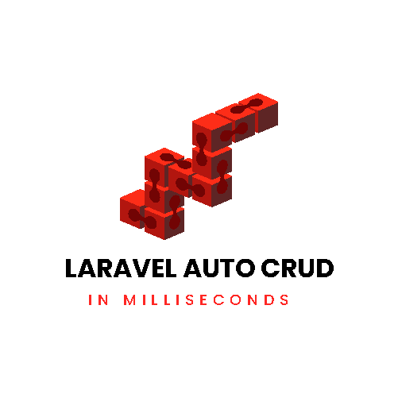

# Laravel Auto CRUD Generator



Laravel Auto CRUD Generator is a package that simplifies CRUD (Create, Read, Update, Delete) operations for your Laravel application. With a single command, you can generate all necessary files and logic for a selected model, reducing development time and effort.

[Watch the Video on YouTube](https://www.youtube.com/watch?v=6IqRc3OgUIM)

## Features
- Automatically detects models in the app/Models folder.
- Provides an interactive CLI to select a model.
- Generates controller, request validation, routes, views, and more.
- Follows Laravel's best practices for clean and maintainable code.

## Installation

You can install the package via Composer:

```bash
composer require mrmarchone/laravel-auto-crud --dev
```

## Usage

To generate CRUD operations for a model, use the following Artisan command:

```bash
php artisan auto-crud:generate
```

### Example:

```bash
php artisan auto-crud:generate
```


This will generate:
- API Controller:
```php
<?php
namespace App\Http\Controllers\API;

use App\Http\Controllers\Controller;
use App\Http\Requests\UserRequest;
use App\Http\Resources\UserResource;
use App\Models\User;
use Illuminate\Http\Request;
use Symfony\Component\HttpFoundation\Response;

class UserController extends Controller
{
    public function index()
    {
        return UserResource::collection(User::latest()->paginate(10));
    }
    
    public function store(UserRequest $request)
    {
        try {
            $user = User::create($request->validated());
            return new UserResource($user);
        } catch (\Exception $exception) {
            report($exception);
            return response()->json(['error' => 'Deleted successfully'], Response::HTTP_INTERNAL_SERVER_ERROR);
        }
    }
    
    public function show(User $user)
    {
        return UserResource::make($user);
    }
    
    public function update(UserRequest $request, User $user)
    {
        try {
            $user->update($request->validated());
            return new UserResource($user);
        } catch (\Exception $exception) {
            report($exception);
            return response()->json(['error' => 'Deleted successfully'], Response::HTTP_INTERNAL_SERVER_ERROR);
        }
    }
    
    public function destroy(User $user)
    {
        try {
            $user->delete();
            return response()->json(['message' => 'Deleted successfully'], Response::HTTP_NO_CONTENT);
        } catch (\Exception $exception) {
            report($exception);
            return response()->json(['error' => 'Deleted successfully'], Response::HTTP_INTERNAL_SERVER_ERROR);
        }
    }
}
```
- Web Controller:
```php
<?php

namespace App\Http\Controllers;

use App\Http\Controllers\Controller;
use App\Http\Requests\UserRequest;
use App\Models\User;

class UserController extends Controller
{
    public function index()
    {
        $users = User::latest()->paginate(10);
        return view('users.index', compact('users'));
    }

    public function create()
    {
        return view('users.create');
    }

    public function store(UserRequest $request)
    {
        User::create($request->validated());
        return redirect()->route('users.index')->with('success', 'Created successfully');
    }

    public function show(User $user)
    {
        return view('users.show', compact('user'));
    }

    public function edit(User $user)
    {
        return view('users.edit', compact('user'));
    }

    public function update(UserRequest $request, User $user)
    {
        $user->update($request->validated());
        return redirect()->route('users.index')->with('success', 'Updated successfully');
    }

    public function destroy(User $user)
    {
        $user->delete();
        return redirect()->route('users.index')->with('success', 'Deleted successfully');
    }
}
```
- Request:
```php
<?php

namespace App\Http\Requests;

use Illuminate\Foundation\Http\FormRequest;

class UserRequest extends FormRequest
{
    public function authorize(): bool
    {
        return true;
    }

    public function rules(): array
    {
        return [
            'name' => 'required|string|max:255',
            'email' => 'required|string|max:255|unique:users,email',
            'email_verified_at' => 'nullable|date',
            'password' => 'required|string|max:255',
            'remember_token' => 'nullable|string|max:100',
        ];
    }
}
```
- Resource:
```php
<?php

namespace App\Http\Resources;

use Illuminate\Http\Request;
use Illuminate\Http\Resources\Json\JsonResource;

class UserResource extends JsonResource
{
    public function toArray(Request $request): array
    {
        return [
            'id' => $this->id,
            'name' => $this->name,
            'email' => $this->email,
            'email_verified_at' => $this->email_verified_at,
            'password' => $this->password,
            'remember_token' => $this->remember_token,
            'created_at' => $this->created_at,
            'updated_at' => $this->updated_at,
        ];
    }
}
```
- API Routes:
```php
<?php

use Illuminate\Support\Facades\Route;

Route::apiResource('/users', App\Http\Controllers\API\UserController::class);
```
- Web Routes:
```php
<?php

use Illuminate\Support\Facades\Route;


Route::resource('/users', App\Http\Controllers\UserController::class);
```
- Views (if applicable):
  - 
- CURL (if applicable): 
  - You will find it in the laravel-auto-crud folder under the name curl.txt.
```bash
=====================User=====================
curl --location 'http://127.0.0.1:8000/api/users' \
--header 'Accept: application/json' \
--header 'Content-Type: application/json' \
--request POST \
--data '{
    "name": "value",
    "email": "value",
    "email_verified_at": "value",
    "password": "value",
    "remember_token": "value"
}'

curl --location 'http://127.0.0.1:8000/api/users/:id' \
--header 'Accept: application/json' \
--header 'Content-Type: application/json' \
--request PATCH \
--data '{
    "name": "value",
    "email": "value",
    "email_verified_at": "value",
    "password": "value",
    "remember_token": "value"
}'

curl --location 'http://127.0.0.1:8000/api/users/:id' \
--header 'Accept: application/json' \
--header 'Content-Type: application/json' \
--request DELETE

curl --location 'http://127.0.0.1:8000/api/users' \
--header 'Accept: application/json' \
--header 'Content-Type: application/json' \
--request GET

curl --location 'http://127.0.0.1:8000/api/users/:id' \
--header 'Accept: application/json' \
--header 'Content-Type: application/json' \
--request GET

=====================User=====================
```

## Requirements

- Laravel 10+
- PHP 8.0+

## Contributing

Contributions are welcome! Feel free to open an issue or submit a pull request.

## License

This package is open-source and available under the MIT License.

